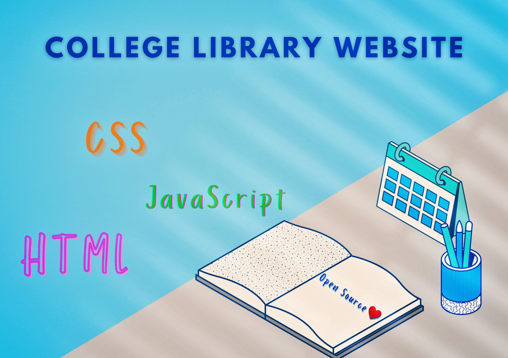

<h1 align="center">College Library Website</h1>

This is a College Library Website in which you can keep a record of all the books you have issued. ( In development Phase )
<h2> Website: https://flash-aec-library.web.app </h2>


So, Here you go!! Using this College Library Website you can keep a record of all your college Books and stuffs 🤩. Excited?

<p align="center"></p>

# Contribution is fun! 🧡:

In order to make a hassle-free environment, I implore you all (_while contributing_) to follow the instructions mentioned below!

Happy Submissions :slightly_smiling_face:

## Contribution Guidelines🏗

Are we missing any of your favorite features, which you think you can add to it❓ We invite you to contribute to this project and make it better. 
To start contributing, follow the below guidelines: 

**1.**  Fork [this](https://github.com/Yell0wflash/Aec-Library-Website) repository.

**2.**  Clone your forked copy of the project.

```
https://github.com/Yell0wflash/Aec-Library-Website.git

```
<h2>📬 Contact</h2>

If you want to contact me, you can reach me through below handles.

<div align="center">
</div>

© 2021 Kooya


[](https://forthebadge.com)
